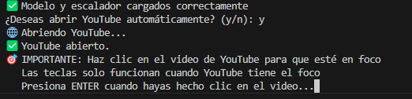
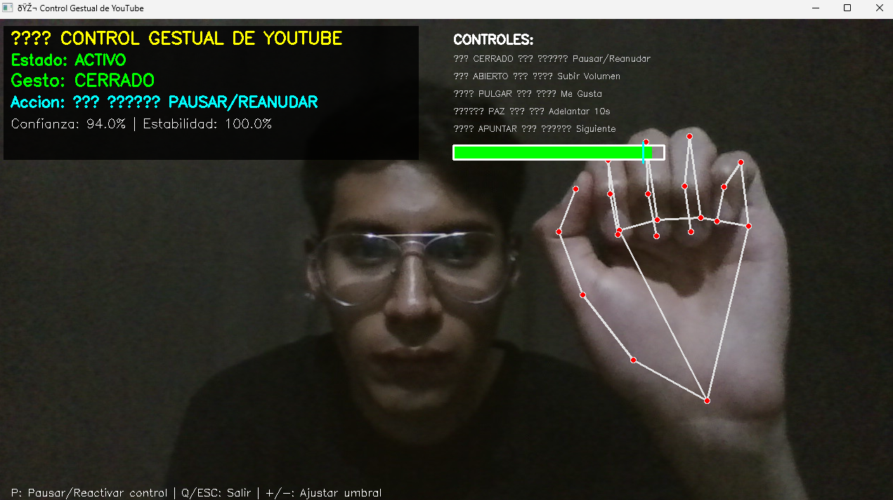
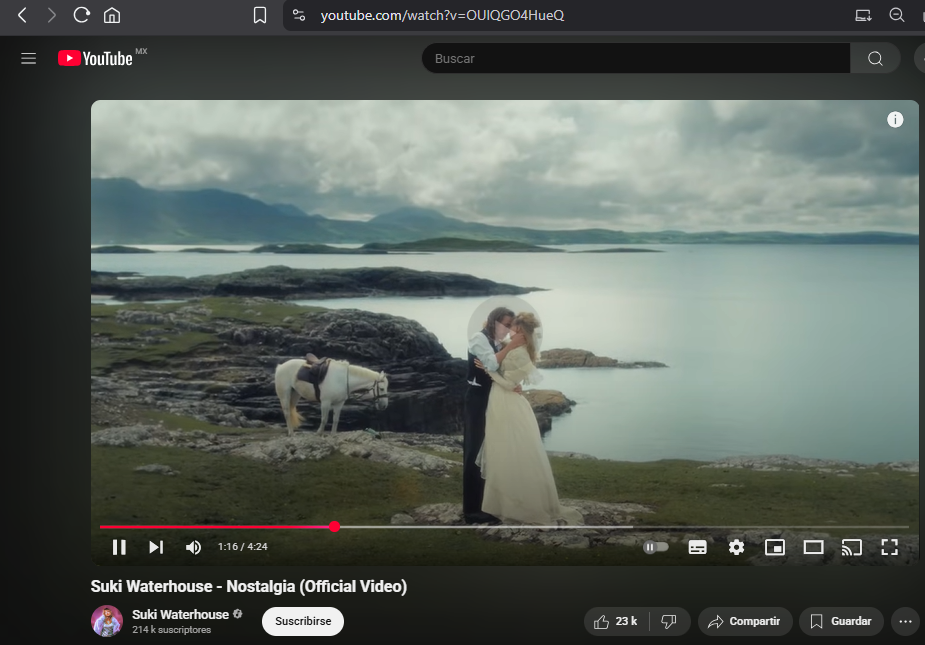

# Sistema de Reconocimiento de Gestos en Tiempo Real


### Integrantes:

* José Alonso Domínguez Castillo 
* José David Esquivel Crúz
* Aldo Jesús Martinez Larios

## Descripción del Proyecto

El fin de este proyecto es implementar un sistema inteligente de reconocimiento de gestos de mano que utiliza Machine Learning y Computer Vision para clasificar y ejecutar acciones basadas en gestos capturados en tiempo real a través de la webcam.

### Objetivo
El objetivo de este proyecto es el desarrollar una aplicación que pueda reconocer automáticamente gestos de mano específicos y ejecutar acciones predefinidas, simulando un sistema de control por gestos para aplicaciones multimedia.

### Tecnologías Utilizadas
- **Python 3.8+**
- **MediaPipe** - Extracción de landmarks de manos
- **OpenCV** - Procesamiento de video e interfaz visual
- **Scikit-learn** - Modelos de Machine Learning
- **Pandas & NumPy** - Manipulación de datos
- **Matplotlib & Seaborn** - Visualización de resultados

## Gestos Reconocidos

| Gesto | Descripción | Acción Simulada |
|-------|-------------|-----------------|
| **✊ Cerrado** | Puño cerrado | ⏸ Pausar/Reanudar video |
| **✋ Abierto** | Mano completamente abierta | 🔊 Subir volumen |
| **👍 Pulgar Arriba** | Like/Me gusta | 👍 Dar "Me gusta" |
| **✌️ Paz** | Señal de paz (V) | Adelantar 10 segundos |
| **👉 Apuntar** | Dedo índice señalando | ⏭️ Siguiente video |


## Características Principales

- **Captura de Dataset Personalizada**: Un sistema interactivo que permite generar datos de entrenamiento
- **Múltiples Modelos ML**: Comparación entre Logistic Regression y Random Forest
- **Reconocimiento en Tiempo Real**: Un procesamiento de video con baja latencia
- **Sistema de Confianza**: Umbrales ajustables para mejorar precisión
- **Suavizado de Predicciones**: Cuenta con un buffer temporal para estabilizar resultados
- **Interfaz Visual Intuitiva**: Un feedback visual con barras de confianza

## Estructura del Proyecto

```
gesture-recognition/
├── 📄 capturar_dataset.py      # Captura de datos de entrenamiento
├── 📄 entrenamiento_modelo.py          # Entrenamiento de modelos ML
├── 📄 reconocimiento.py # Aplicación de reconocimiento
├── 📄 youtube_gesture_control.py  # 🎬 Control gestual de YouTube
├── 📄 gesture_dataset.csv     # Dataset generado (después de captura)
├── 📄 gesture_model.pkl       # Modelo entrenado (después de training)
├── 📄 gesture_scaler.pkl      # Escalador de datos
├── 📄 requirements.txt        # Dependencias del proyecto
└── 📄 README.md              # Este archivo
```

## Instalación y Configuración

### 1. Clonar el Repositorio
```bash
git clone https://github.com/tu-usuario/gesture-recognition.git
cd gesture-recognition
```

### 2. Crear Entorno Virtual
```bash
python -m venv venv
source venv/bin/activate  # En Windows: venv\Scripts\activate
```

### 3. Instalar Dependencias
```bash
pip install -r requirements.txt
```

## Proceso de Desarrollo

### Paso 1: Recolección de Datos
```bash
python capturar_dataset.py
```

**Funcionalidades:**
- Captura interactiva de gestos a través de webcam
- 50 muestras por gesto para dataset balanceado
- Extracción automática de 21 landmarks de mano (42 coordenadas x,y)
- Almacenamiento en formato CSV optimizado

**Controles:**
- `ESPACIO`: Capturar muestra del gesto actual
- `N`: Cambiar al siguiente gesto
- `Q`: Finalizar captura

### Paso 2: Entrenamiento del Modelo 
```bash
python entrenamiento_modelo.py
```

**Proceso automático:**
1. **Carga y validación** del dataset
2. **Preprocesamiento** con StandardScaler
3. **Entrenamiento** de múltiples modelos:
   - Logistic Regression
   - Random Forest Classifier
4. **Evaluación comparativa** con métricas de rendimiento
5. **Análisis de umbrales** de confianza
6. **Selección automática** del mejor modelo
7. **Guardado** de modelo y escalador

### Paso 3: Reconocimiento en Tiempo Real 
```bash
python reconocimiento.py
```

**Características avanzadas:**
- **Detección de manos** con MediaPipe
- **Predicción con umbral** de confianza ajustable (90% por defecto)
- **Suavizado temporal** con buffer de 5 frames
- **Feedback visual** en tiempo real
- **Control dinámico** de umbrales

**Controles en vivo:**
- `Q`: Salir de la aplicación
- `+`: Aumentar umbral de confianza
- `-`: Disminuir umbral de confianza


## Limitaciones Conocidas

- **Iluminación**: Sensible a condiciones de luz extremas
- **Fondo**: Mejor rendimiento con fondos contrastantes
- **Distancia**: Óptimo entre 0.5-1.5 metros de la cámara
- **Velocidad**: Gestos muy rápidos pueden no ser detectados


## Proceso de Implementación
Este proyecto fue desarrollado siguiendo una serie de pasos estructurados para lograr un sistema funcional de reconocimiento de gestos por webcam. A continuación, se detalla el proceso completo:

**1. Diseño del flujo de trabajo**
Se definieron las siguientes etapas fundamentales:

- Captura de datos: obtener muestras de gestos con la webcam.

- Entrenamiento del modelo: procesar las muestras y entrenar un clasificador.

- Reconocimiento en tiempo real: usar el modelo entrenado para detectar gestos en vivo.

**2. Captura de Dataset** (capturar_dataset.py)

Se desarrolló un script que usa MediaPipe para detectar los 21 puntos clave (landmarks) de una mano. Este extrae sus coordenadas (x, y) y las guarda en un archivo CSV y permite capturar gestos de forma interactiva con las teclas:

- ESPACIO: Captura una muestra del gesto actual.

- N: Cambia al siguiente gesto en la lista.

- Q: Termina la sesión de captura.

Guarda automáticamente los datos etiquetados con el nombre del gesto seleccionado.

**3. Entrenamiento del Modelo** (entrenamiento_modelo.py)

Este script lee el archivo CSV con los datos capturados y escala los datos con StandardScaler para entrena dos modelos de Machine Learning con Scikit-learn (Regresión Logística y Random Forest)

Este evalúa ambos modelos y selecciona el que obtiene mayor precisión y guarda el modelo final (modelo.pkl) y el escalador (scaler.pkl) para su uso posterior.

**4. Reconocimiento en Tiempo Real** (reconocimiento.py)

Este script es la aplicación principal para uso en vivo. Realiza lo siguiente:

- Captura el video en tiempo real desde la cámara.

- Usa MediaPipe para extraer los landmarks.

- Aplica el modelo entrenado para predecir el gesto mostrado.

- Muestra la predicción, junto con su nivel de confianza, en pantalla.

- Implementa un sistema de suavizado temporal con un buffer de predicciones para evitar falsos positivos.

Acciones disponibles:

* Q: Salir

* + / - : Ajustar el umbral de confianza

## Aplicación Práctica - Control de YouTube

### Control Gestual de YouTube 
```bash
python youtube_gesture_control.py
```

Esta aplicación revolucionaria permite controlar YouTube directamente con gestos de mano, creando una experiencia completamente hands-free.

### Demostración de Uso

#### **1. Inicio de la Aplicación**
Al ejecutar el script, se abre automáticamente la interfaz:


*Interfaz principal mostrando la detección de manos en tiempo real*

La aplicación detecta automáticamente tu mano y muestra:
- **Panel de información** con el gesto actual
- **Barra de confianza** en tiempo real
- **Estado de las acciones** ejecutadas
- **Controles disponibles** en el lateral

#### **2. Ejemplo: Pausar Video con Gesto de Puño**



*Detección del gesto "puño cerrado" para pausar el video*

**Proceso paso a paso:**
1. **Detección**: La cámara detecta tu mano y extrae los 21 landmarks
2. **Clasificación**: El modelo ML identifica el gesto como "CERRADO"
3. **Confianza**: Verifica que la confianza sea superior al 90%
4. **Acción**: Envía automáticamente la tecla `SPACE` a YouTube
5. **Resultado**: El video se pausa instantáneamente


*Video de YouTube pausado exitosamente mediante gesto*

#### **3. Control de Volumen con Mano Abierta**

*Gesto de mano abierta aumentando el volumen*

Cuando detecta una **mano completamente abierta**:
- El sistema reconoce el gesto "ABIERTO"
- Envía la tecla `↑` (flecha arriba)
- YouTube aumenta automáticamente el volumen


### Características Especiales

#### **Sistema de Seguridad Inteligente:**
- **Cooldown de 2 segundos**: Previene acciones accidentales repetidas
- **Umbral de confianza**: Solo ejecuta con 90%+ de certeza
- **Control de pausa**: Tecla `P` para pausar/reanudar el control gestual

#### **Feedback Visual Avanzado:**
```
CONTROL GESTUAL DE YOUTUBE
Estado: ACTIVO
Gesto: CERRADO 
Accion: PAUSAR/REANUDAR
Confianza: 94% | Estabilidad: 87%
```

#### **Compatibilidad Universal:**
-  **Chrome, Firefox, Safari, Edge**
-  **YouTube, YouTube Music, YouTube TV**
-  **Windows, macOS, Linux**
-  **Pantalla completa y modo ventana**

### Configuración Técnica

#### **Requisitos del Sistema:**
- **Cámara web** funcional (mínimo 720p recomendado)
- **Iluminación adecuada** (evitar contraluz)
- **Distancia óptima**: 50cm - 1.5m de la cámara
- **RAM**: Mínimo 4GB (8GB recomendado)
- **CPU**: Soporte para procesamiento en tiempo real

#### **Instalación de Dependencias Adicionales:**
```bash
pip install pyautogui pynput
```

#### **Configuración Inicial:**
1. **Abrir YouTube** en tu navegador preferido
2. **Reproducir cualquier video**
3. **Hacer clic en el video** (importante para el foco)
4. **Ejecutar la aplicación**
5. **¡Disfrutar del control gestual!**
